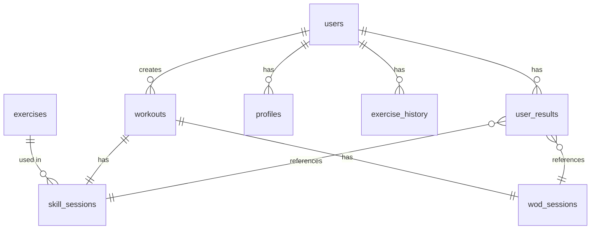

# Дизайн документ: CrossFit Workout Tracker (MVP)

## Архитектура системы

### Технический стек

| Уровень | Технология |
|---------|------------|
| Frontend | Next.js 14 (App Router) + TypeScript + Tailwind CSS |
| Backend | Next.js API Routes + Node.js |
| Database | PostgreSQL + Prisma ORM |
| Auth | NextAuth.js (Credentials + OAuth) |
| Deployment | Docker (локально), VPS Timeweb (продакшн) |
| Testing | Vitest + React Testing Library + Playwright |

### Архитектурные решения

#### 1. Многоуровневая архитектура
```
Frontend (Next.js)
    ↓
API Routes (/api/*)
    ↓
Services (business logic)
    ↓
Prisma ORM
    ↓
PostgreSQL
```

#### 2. Стратегия разделения ответственности

**Личные данные** (видны только пользователю):
- Личные тренировки
- Личные результаты
- Личный профиль
- Статистика

**Планируемые фичи после MVP:**
- Клубные данные (видны всем участникам клуба)
- Клубный лидерборд
- Статистика клуба

#### 3. Система ролей и прав

| Операция | Admin | Visitor |
|----------|-------|---------|
| Управление системой | ✓ | ✗ |
| Создать тренировку | ✓ | ✓ |
| Записать результат | ✓ | ✓ |
| Видеть свои данные | ✓ | ✓ |
| Видеть чужие данные | ✓ | ✗ |

---

## Схема базы данных

### Таблицы и связи



### Детальное описание таблиц

#### users
```sql
id              UUID PRIMARY KEY
email           VARCHAR(255) UNIQUE NOT NULL
password_hash   VARCHAR(255) NOT NULL
role            VARCHAR(20) NOT NULL CHECK (role IN ('admin', 'visitor'))
created_at      TIMESTAMP DEFAULT NOW()
updated_at      TIMESTAMP DEFAULT NOW()
```

#### workouts
```sql
id              UUID PRIMARY KEY
author_id       UUID REFERENCES users(id) NOT NULL
name            VARCHAR(255) NOT NULL
type            VARCHAR(10) NOT NULL CHECK (type IN ('skill', 'wod'))
created_at      TIMESTAMP DEFAULT NOW()
updated_at      TIMESTAMP DEFAULT NOW()
```

#### skill_sessions
```sql
id              UUID PRIMARY KEY
workout_id      UUID REFERENCES workouts(id) NOT NULL
exercise_name   VARCHAR(255) NOT NULL
exercise_category VARCHAR(50)
sets_json       JSONB NOT NULL DEFAULT '[]'
max_weight      DECIMAL(6,2)
created_at      TIMESTAMP DEFAULT NOW()
```

#### wod_sessions
```sql
id              UUID PRIMARY KEY
workout_id      UUID REFERENCES workouts(id) NOT NULL
wod_type        VARCHAR(20) NOT NULL CHECK (wod_type IN ('emom', 'amrap', 'fortime', 'forload', 'ladder', 'chipper', 'tabata'))
duration_minutes INTEGER
total_rounds    INTEGER
total_reps      INTEGER
weight          DECIMAL(6,2)
equipment       VARCHAR(100)
created_at      TIMESTAMP DEFAULT NOW()
```

#### user_results
```sql
id              UUID PRIMARY KEY
user_id         UUID REFERENCES users(id) NOT NULL
skill_session_id UUID REFERENCES skill_sessions(id) NULL
wod_session_id  UUID REFERENCES wod_sessions(id) NULL
result_value    DECIMAL(10,2) NOT NULL
result_type     VARCHAR(20) NOT NULL CHECK (result_type IN ('time', 'weight', 'reps', 'rounds'))
is_scaled       BOOLEAN DEFAULT FALSE
recorded_by     UUID REFERENCES users(id) NOT NULL
created_at      TIMESTAMP DEFAULT NOW()
UNIQUE(user_id, skill_session_id)
UNIQUE(user_id, wod_session_id)
```

#### profiles
```sql
id              UUID PRIMARY KEY
user_id         UUID REFERENCES users(id) UNIQUE NOT NULL
name            VARCHAR(255)
avatar_url      TEXT
gender          VARCHAR(10)
bio             TEXT
phone           VARCHAR(20)
telegram        VARCHAR(100)
privacy_level   VARCHAR(20) DEFAULT 'all' CHECK (privacy_level IN ('all', 'none'))
created_at      TIMESTAMP DEFAULT NOW()
updated_at      TIMESTAMP DEFAULT NOW()
```

#### exercises
```sql
id              UUID PRIMARY KEY
name            VARCHAR(255) UNIQUE NOT NULL
category        VARCHAR(50) NOT NULL CHECK (category IN ('cardio', 'weights', 'bodyweight'))
subcategory     VARCHAR(50)
description     TEXT
is_default      BOOLEAN DEFAULT TRUE
```

#### exercise_history
```sql
id              UUID PRIMARY KEY
user_id         UUID REFERENCES users(id) NOT NULL
exercise_name   VARCHAR(255) NOT NULL
last_workout_id UUID REFERENCES workouts(id)
last_result     DECIMAL(10,2)
last_result_date TIMESTAMP
last_result_type VARCHAR(20)
created_at      TIMESTAMP DEFAULT NOW()
updated_at      TIMESTAMP DEFAULT NOW()
UNIQUE(user_id, exercise_name)
```

### Индексы

```sql
-- Для быстрого поиска
CREATE INDEX idx_workouts_author_id ON workouts(author_id);
CREATE INDEX idx_user_results_user_id ON user_results(user_id);
CREATE INDEX idx_user_results_created_at ON user_results(created_at);
CREATE INDEX idx_exercises_name ON exercises(name);
CREATE INDEX idx_users_email ON users(email);
CREATE INDEX idx_profiles_user_id ON profiles(user_id);
```

---

## API Спецификация

### Аутентификация

#### POST /api/auth/register
```json
Request:
{
  "email": "user@example.com",
  "password": "string"
}

Response:
{
  "user": {
    "id": "uuid",
    "email": "user@example.com",
    "role": "visitor"
  }
}
```

#### POST /api/auth/login
```json
Request:
{
  "email": "user@example.com",
  "password": "string"
}

Response:
{
  "user": {
    "id": "uuid",
    "email": "user@example.com",
    "role": "visitor"
  }
}
```

#### GET /api/auth/me
```json
Response:
{
  "user": {
    "id": "uuid",
    "email": "user@example.com",
    "role": "visitor"
  }
}
```

#### POST /api/auth/logout
```json
Response:
{
  "success": true
}
```

### Тренировки

#### POST /api/workouts
```json
Request (Skill):
{
  "type": "skill",
  "name": "Приседания",
  "exercise_name": "Back Squat",
  "sets": [
    {"set_num": 1, "reps": 10, "weight": 100},
    {"set_num": 2, "reps": 10, "weight": 100},
    {"set_num": 3, "reps": 8, "weight": 110},
    {"set_num": 4, "reps": 8, "weight": 110},
    {"set_num": 5, "reps": 6, "weight": 120}
  ]
}

Request (WOD):
{
  "type": "wod",
  "name": "Fran",
  "wod_type": "amrap",
  "duration_minutes": 2,
  "exercises": [
    {"name": "Deadlift", "weight": 135, "reps": 21},
    {"name": "Pull-ups", "reps": 14},
    {"name": "Push-press", "weight": 95, "reps": 7}
  ]
}

Response:
{
  "workout": {
    "id": "uuid",
    "name": "Fran",
    "type": "wod"
  }
}
```

#### GET /api/workouts
```json
Query Params:
- type: skill|wod (optional)
- date_from: ISO string (optional)
- date_to: ISO string (optional)
- limit: number (optional, default 20)
- offset: number (optional, default 0)

Response:
{
  "workouts": [...],
  "total": number
}
```

#### GET /api/workouts/:id
```json
Response:
{
  "workout": {
    "id": "uuid",
    "name": "Fran",
    "type": "wod",
    "created_at": "2024-01-01T00:00:00Z"
  }
}
```

#### PUT /api/workouts/:id
```json
Request:
{
  "name": "Fran Updated"
}

Response:
{
  "workout": {
    "id": "uuid",
    "name": "Fran Updated",
    "type": "wod"
  }
}
```

#### DELETE /api/workouts/:id
```json
Response:
{
  "success": true
}
```

### Результаты

#### POST /api/results
```json
Request:
{
  "workout_id": "uuid",
  "result_value": 100,
  "result_type": "weight",
  "is_scaled": false
}

Response:
{
  "result": {
    "id": "uuid",
    "user_id": "uuid",
    "result_value": 100,
    "result_type": "weight"
  }
}
```

#### GET /api/results
```json
Query Params:
- period: day|week|month|year|all (optional)
- exercise_id: uuid (optional)
- exercise_name: string (optional)

Response:
{
  "results": [...],
  "stats": {
    "best_result": 100,
    "best_date": "2024-01-01",
    "trend": "up"
  }
}
```

#### PUT /api/results/:id
```json
Request:
{
  "result_value": 110
}

Response:
{
  "result": {
    "id": "uuid",
    "result_value": 110
  }
}
```

#### DELETE /api/results/:id
```json
Response:
{
  "success": true
}
```

#### GET /api/results/similar
```json
Query Params:
- exercise_name: string (required)

Response:
{
  "similar_workouts": [
    {
      "workout_id": "uuid",
      "workout_name": "Fran",
      "result_value": 100,
      "result_date": "2024-01-01",
      "result_type": "time"
    }
  ]
}
```

### Профиль

#### GET /api/profile
```json
Response:
{
  "profile": {
    "id": "uuid",
    "user_id": "uuid",
    "name": "Ivan",
    "avatar_url": "https://...",
    "gender": "male",
    "bio": "CrossFit enthusiast",
    "phone": "+79991234567",
    "telegram": "@ivan",
    "privacy_level": "all"
  }
}
```

#### PUT /api/profile
```json
Request:
{
  "name": "Ivan",
  "avatar_url": "https://...",
  "gender": "male",
  "bio": "CrossFit enthusiast",
  "phone": "+79991234567",
  "telegram": "@ivan",
  "privacy_level": "all"
}
```

#### GET /api/profile/stats
```json
Response:
{
  "stats": {
    "streak": 10,
    "workouts_this_month": 15,
    "total_workouts": 100,
    "best_results": [...]
  }
}
```

### Упражнения

#### GET /api/exercises
```json
Query Params:
- category: cardio|weights|bodyweight (optional)
- search: string (нечеткий поиск)

Response:
{
  "exercises": [
    {
      "id": "uuid",
      "name": "Back Squat",
      "category": "weights",
      "subcategory": "squats"
    }
  ]
}
```

---

## UI/UX Спецификация

### Цветовая палитра (Dark Theme)

| Элемент | Цвет |
|---------|------|
| Background | #0a0a0a |
| Surface | #1a1a1a |
| Primary | #ff3b30 (Red) |
| Secondary | #30ff88 (Green) |
| Accent | #ffbd00 (Yellow) |
| Text Main | #ffffff |
| Text Secondary | #a0a0a0 |
| Border | #333333 |

### Типографика

| Элемент | Размер | Вес |
|---------|--------|-----|
| H1 | 32px | 700 |
| H2 | 24px | 600 |
| H3 | 20px | 600 |
| Body | 16px | 400 |
| Caption | 14px | 400 |
| Result | 48px | 800 |

### Компоненты

#### 1. Header
- Логотип
- Навигация (Home, Calendar, History, Profile)
- Меню пользователя (выход)

#### 2. Calendar
- Месячный календарь
- Цветные индикаторы:
  - Серый: не начато
  - Желтый: в процессе
  - Зеленый: выполнено
- Клик по дню → модальное окно с деталями

#### 3. Workout Creator
- Шаг 1: Выбор типа (Skill / WOD)
- Шаг 2: Выбор упражнения (fuzzy search)
- Шаг 3: Ввод параметров
- Шаг 4: Подтверждение

#### 4. History
- Список тренировок с пагинацией
- Фильтры (тип, дата, упражнение)
- Карточки тренировок с кнопкой редактирования

#### 5. Profile
- Аватар (круглый, 120px)
- Информация о пользователе
- Статистика (строки):
  - Стрик: 10 дней
  - Тренировок в месяце: 15
  - Всего тренировок: 100
- Настройки приватности

### Анимации

| Событие | Анимация |
|---------|----------|
| Рекорд | Салют + вибрация (мобильные) |
| Редактирование результата | Плавное обновление |
| Загрузка | Skeleton loader |

---

## Оптимизация и производительность

### Кэширование

| Данные | TTL | Механизм |
|---------|-----|----------|
| Профили | 10 мин | Redis |
| Упражнения | 1 час | Redis |
| Календарь | 1 мин | Redis |

### Пагинация

- Стандартный размер: 20 элементов
- Максимальный размер: 100 элементов
- Cursor-based pagination для больших списков

### Оптимизация запросов

- Использование JOIN вместо N+1 запросов
- Индексы для часто используемых фильтров
- Lazy loading для изображений
- Debounce для поиска

---

## Безопасность

### Аутентификация

- NextAuth.js с Credentials Provider
- JWT токены с expiration 7 дней
- Refresh tokens для продления сессии

### Авторизация

- RBAC (Role-Based Access Control)
- Проверка прав на уровне API (user_id в запросах)
- Проверка прав на уровне UI (скрытие недоступных кнопок)

### Валидация

- Валидация входных данных на сервере
- SQL инъекции (Prisma ORM защищает)
- XSS (React по умолчанию экранирует)

---

## PWA Конфигурация

### manifest.json
```json
{
  "name": "CrossFit Tracker",
  "short_name": "CrossFit",
  "start_url": "/",
  "display": "standalone",
  "background_color": "#0a0a0a",
  "theme_color": "#ff3b30",
  "icons": [
    {
      "src": "/icon-192.png",
      "sizes": "192x192",
      "type": "image/png"
    },
    {
      "src": "/icon-512.png",
      "sizes": "512x512",
      "type": "image/png"
    }
  ]
}
```

### Service Worker

- Cache-first стратегия для статических файлов
- Network-first для API запросов
- Auto-update при новой версии

---

## План разработки

### Phase 1: UI/UX Мокапы (1 неделя)
- Wireframes экранов создания тренировки
- Wireframes календаря
- Wireframes истории
- Wireframes профиля
- Утверждение структуры данных на основе мокапов

### Phase 2: Архитектура и База данных (1-2 недели)
- Настройка проекта Next.js
- Настройка PostgreSQL + Prisma
- Создание schema.prisma с MVP-схемой
- Выполнение `npx prisma generate` и `npx prisma migrate dev`
- Реализация Auth системы
- Базовые компоненты UI

### Phase 3: Core Features (2-3 недели)
- CRUD тренировок
- Запись результатов
- Календарь
- Профиль пользователя
- История

### Phase 4: Polish & PWA (1 неделя)
- Оптимизация производительности
- PWA функционал (manifest, service worker)
- E2E тесты
- Документация

### Phase 5: Расширение (после MVP)
- Система клубов и приглашений
- Лидерборды
- Достижения
- Геймификация

---

## Примечания по структуре БД

### Поле `sets_json` в таблице `skill_sessions`

Для хранения схемы подходов добавлено поле `sets_json` типа JSONB:

**Пример:**
```json
[
  {"set_num": 1, "reps": 10, "weight": 100},
  {"set_num": 2, "reps": 10, "weight": 100},
  {"set_num": 3, "reps": 8, "weight": 110}
]
```

### Поле `exercises` в таблице `wod_sessions`

Для хранения состава WOD добавлено поле `exercises` типа JSONB:

**Пример:**
```json
[
  {"name": "Deadlift", "weight": 135, "reps": 21},
  {"name": "Pull-ups", "reps": 14},
  {"name": "Push-press", "weight": 95, "reps": 7}
]
```

Такой подход позволяет:
- Хранить любую структуру тренировки без жесткой схемы
- Легко расширять форматы в будущем
- Использовать JSONB-операции PostgreSQL для поиска и фильтрации

### Планируемое расширение для клубной системы

Для будущего добавления клубов достаточно добавить таблицы:
- `clubs` - клубы
- `club_members` - связи пользователей с клубами
- `club_workouts` - клубные тренировки

Связь `workouts` с `clubs` будет опциональной (club_id NULL для личных тренировок).